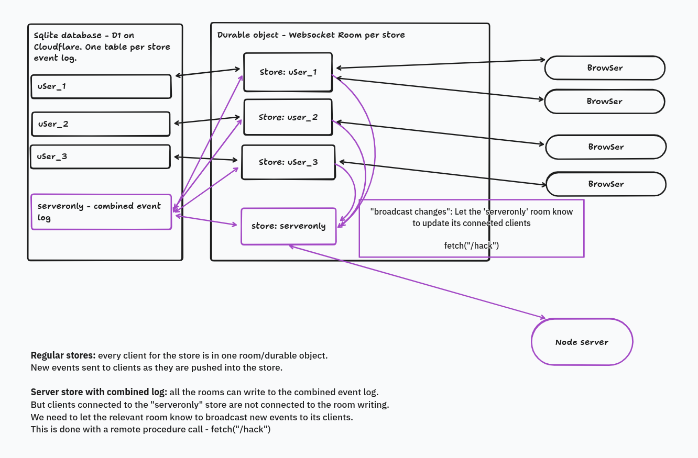

# Authentication experiment

This is deployed [here](https://livestore-chat.netlify.app/).
In an attempt to simplify things, this is not even a chat anymore :).

At the time of writing, the expected experience is:

- you get a "sign in by email" form
- you sign in
- you see a screen with your data (=your email basically). 

## Context

In LiveStore, by default any user with a `storeId` can pull and push events.
From a security perspective the `storeId` behaves like an authentication token that never expires.
The `storeId` is often a non-guessable id (ex: uuid), and this might be an acceptable security model for some apps.

[The docs have an authentication example](https://docs.livestore.dev/patterns/auth/) that shows how to restrict access to authenticated users. 
But **all users can access all stores** (provided they have the storeId).

The docs example refers to an authentication token for the user. Where do we get this token from?

There are several options. You could use an external authentication system (including something like Google Signin).
This demo tries to **manage as much state in LiveStore as possible** and rely on that to generate the token.

Users and emails are managed by LiveStore. 
There's still an API to login/signup/refresh tokens, but if a user updated their email or joined a new workspace (not implemented here), 
they would do so with LiveStore events and not a separate API. This lets us say which stores a user can access from the backend.
It's a pretty subtle distinction, the goal is to have a "pure LiveStore" dev experience on the frontend.

## Some notes

- Everything is behind login, no anonymous users.
- A user can only access their stores, even if they know the storeId of another user.
- Authentication is managed by the backend, a server that acts as a client to the LiveStore sync and provides the API for authentication.
- The backend uses an authentication database not managed by LiveStore (storing email magic links and refresh tokens).
- To keep things minimal, this demo uses one 'user' store per user in frontend. This is a single table with a single row (the user).
But this could be done with something like the `web-todomvc-sync-cf` example from the LiveStore repo.  
This would not change much! The todo app is already collaborative. It would put everything behind a login, and only verified users could access the store (as opposed to anyone with the url).

## Caveats:

- Websocket connection errors to livestore are not handled. I'm not sure how to do that cleanly.
  I can see in devtools LiveStore retries, but it does not help when it's an authentication issue. 

- Passing the storeId in the payload is not really secure, but it demonstrates how it could work with minor changes to LiveStore (=provide a way to access the request `storeId` in `validatePayload`).
  See the `src/cf-worker/index.ts` code and the 'caveat' comment for more details.

## LiveStore modification

For the code look [at the commit](https://github.com/livestorejs/livestore/commit/e23f38b0520047bc8a942ea672b71895666d57ef) rather than the `bun patch` here (it includes an extra unrelated commit).

The authentication by email must match an email to a user. But there are many stores, each with one (or a few) users.
So LiveStore is patched to duplicate events to an aggregated 'serveronly' store. This store can materialize a single table with all the app users.

Changes made are in purple on the picture.

Note that I'm describing the changes, not advocating for them. I wrote this just to see if it could work :). 

## Authentication

Everyone's favorite part. This uses "magic link" emails as the only way to login: user enters email, gets a link to login.
The link grants them auth and refresh tokens (as cookies) and a livestore token as not-a-cookie.

This could probably be done with just one of auth/livestore token, but it's not immediate to use LiveStore with cookies right now, and websocket+cookies requires extra security measures (checking origin at least).

[Full authentication flow with some help from Claude](./auth_flow.md)

## Conclusion

It seems to work.

This checks the user can access a store (provided LiveStore exposes the request storeId). I'm not sure how to achieve finer role based access control right now, [thoughts on Discord](https://discord.com/channels/1154415661842452532/1395462652507197492/1397242417412833391).

I took some general inspiration from [https://github.com/runtimed/anode/](https://github.com/runtimed/anode/). It is a real-time collaborative notebook protected by a Google Sign-in.
This sort of very collaborative application where you don't necessarily need very fine granularity in access control seems like the best fit for LiveStore today.

The stores in LiveStore are the boundaries of access control: it seems challenging to enforce anything finer than read/write permissions on a store.

Also: I now think an approach to authentication/authorization that does not require materializing a consolidated database is possible, happy to chat on Discord if interested.